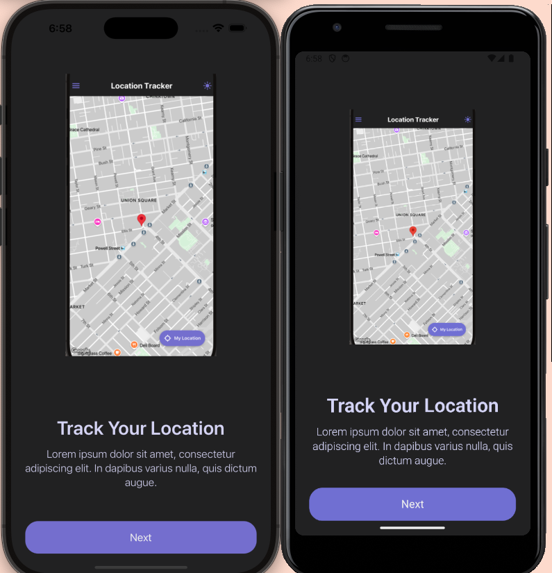
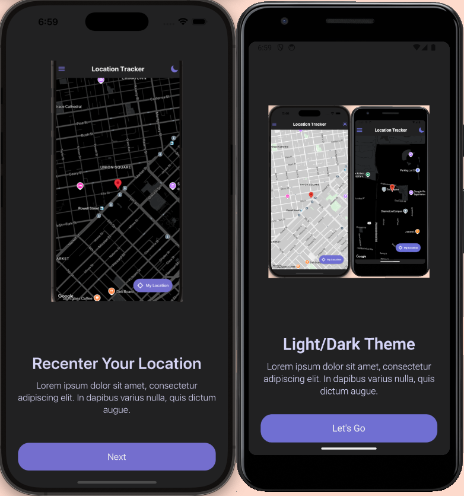
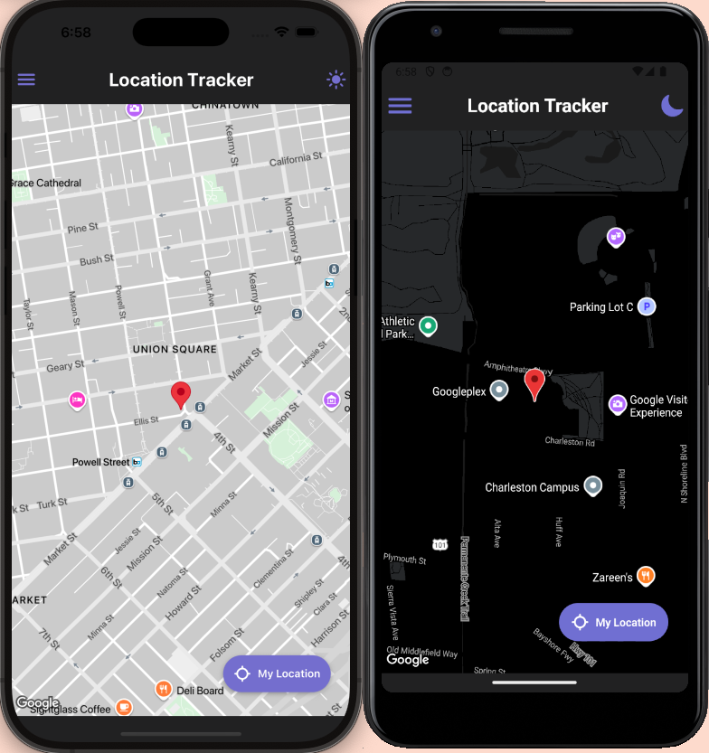

# 🎬 Welcome to the Location Tracker App 👋

This is an [Expo](https://expo.dev) project bootstrapped with [`create-expo-app`](https://www.npmjs.com/package/create-expo-app). It showcases track location functionality, along with seamless screen navigation using Expo Router.

## 🖼️ Screenshots & Demo





---

## 🚀 Getting Started

1. **Install dependencies**

   ```bash
   npm install
   ```

2. **Clean prebuild artifacts**

   ```bash
   npx expo prebuild --clean
   ```

3. **Start the app**

   ```bash
   npx expo start
   ```

You’ll be prompted with options to run the app in:

- A [development build](https://docs.expo.dev/develop/development-builds/introduction/)
- An [Android emulator](https://docs.expo.dev/workflow/android-studio-emulator/)
- An [iOS simulator](https://docs.expo.dev/workflow/ios-simulator/)
- [Expo Go](https://expo.dev/go) — a lightweight way to preview your app on real devices

The project uses [file-based routing](https://docs.expo.dev/router/introduction/), so you can start building screens directly within the `app` directory.

---

## 🧭 Browsing & Navigation

The app utilizes **React Navigation** and **Expo Router** for managing screen transitions. Here's how it's structured:

- **Main Screen (`/index`)**  
  Serves as a splash or landing screen. It provides a welcoming branded interface and acts as a brief introduction before users enter the main app.

- **Home Screen (`/homescreen`)**  
  Displays a map with **Marker**, of your location using **React-Native-Maps**.

  - Animated Sticky Button for Recentering of your location
  - Tap the Marker to show your location address
  - Ability to change the theme of the map (dark or light)

- **Navigation**  
  All routing is handled through Expo Router’s file-based system, which keeps navigation scalable and intuitive.

- **Theming & Styling**  
  The app includes a centralized constants file for consistent design and layout throughout the app. It contains:
  - `SIZES` – for standardized spacing, padding, and dimensions
  - `FONTS` – for reusable typography styles
  - `COLORS` – for maintaining a unified color palette

---

## 🧠 Decisions, Challenges & Known Issues

- **Map Integration**  
  The [React Native Maps](https://github.com/react-native-maps) was selected for its rich content and ease of use.
- **Routing Strategy**  
  **Expo Router** was chosen for its simplicity and tight integration with the project structure, making screen navigation feel seamless and organized.

- **Design Challenge**  
  Custom styling of map based on its theme.

- **Known Issue**  
  While implementing the new React Native architecture, Encounter compatibility or build issues due to outdated tooling. Ensure your local environment is updated, including dependencies such as Xcode, CocoaPods, and Android Studio. Upgrading these tools is required for successful integration and to avoid runtime or build-time errors.

---

## 🔐 Environment Variables

This project uses environment variables to securely manage sensitive data like API keys.

### 📁 Setup Instructions

**Create an `.env` file** in the root of your project (next to `package.json`):

```env
EXPO_PUBLIC_API_MAP_KEY=your_google_map_api_key_here
```

---

## 🔄 Reset to a Fresh Project

If you want to start from scratch:

```bash
npm run reset-project
```

This will archive the starter code in the `app-example` directory and generate a fresh `app` directory for development.

---

## 📚 Learn More

- [📖 Expo Documentation](https://docs.expo.dev/)
- [🚀 Expo Router Intro](https://docs.expo.dev/router/introduction/)
- [🎥 TMDb API Docs](https://developer.themoviedb.org/docs)

---

## 💬 Join the Community

- [GitHub – Expo](https://github.com/expo/expo)
- [Expo Discord](https://chat.expo.dev)

---
